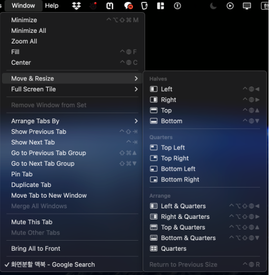

# 맥북 초기 셋팅
- spotlight - turn off "siri suggestions"
- keyboard - turn on "Use F1, F2, etc. keys as standard function keys"
- Download "dropbox", "snap", "karabiner", "sublime text", "magnet"
- In snap, the finder application itself lives in "/System/Library/CoreServices"
- Go to Desktop&Dock - Hot Corners - Set "TopRight as Desktop"
- Set:  Finder's setting - (1)General - Dropbox; (2)adv. - search the current folder
- Set: caps-lock to return and right command to change input source in Karabiner & System Settings
- In Keyboard in System Settings, key repeat rate and delay until rate as follow:

- Set: Tab to Click in System Settings

- In Keyboard - Input sources, set as follows

- Turn off the shortcuts opening mission control or Application windows when pressing control+up or +down

# 추천 프로그램

## Useful 맥북응용프로그램
- 아이폰 미러링
- mathpix
- TeamViewer
- Dropbox
- HashPhotos: 사진 정리 프로그램
- 맥OS 기본 오피스 프로그램 (Keynote, Pages)
  - "Cmd + Opt + E"를 누르면 "Equation"창이 켜지면서 LaTeX 문법을 이용해서 수식을 입력할 수 있다.
  - 그러나, 윈도우PC와의 호환성이 좋지 않기 때문에 (PDF로만 공유 가능),
    - "간단한 수식 입력하고 스크린샷"하는 식으로 주로 이용하거나.
    - 혼자서만 보는 미팅자료 등에서만 이용함.

## 외부 (유료/무료) 프로그램
- Snap: “Cmd+Shift+숫자”로 Dock에 있는 프로그램 실행할 수 있음.
- (유료: Magnet) / (무료: rectangle): “Ctrl+Opt+좌/우” 등으로 화면분할 가능 (화면왼쪽 크롬, 오른쪽 파워포인트 등).
  - 최근 기본단축키로 풀림
  - 
- Karabiner: 키맵핑을 바꿀 수 있음.
  - “Caps Lock” → “Return”, “우측 Cmd” → “한영전환”으로 사용할 수 있음 (맥OS 기본 설정에서 한영전환을 F18로 설정 후 카라비너에서 “우측 Cmd”를 누르면 “F18”을 입력되도록 설정함).
  - 
- (optional) Automator (기본 앱): 반복작업을 위한 매크로 프로그램 (가속화 가능, 2배 빨리감기 등)

# Shortcuts
## General
- “Cmd + , (comma)” : 환경설정 (Setting);  대부분의 앱에서 작동함 !!
- “Cmd + Shift + / (slash)” : Manu 검색;  대부분의 앱에서 작동함 !!
- “Opt + Cmd + esc” : 앱 강제종료
- “Cmd + Opt + D” : Dock 열고 닫기
- “Cmd + Space” : Spotlight Search (앱 검색할때 주로 사용함)
- “Cmd + Opt + Space” : Searching This Mac (Finder를 키는데 사용함)
- “Fn + q” : Quick Note
- “Cmd + Ctr + D” : 사전 (Dictionary)
- “Cmd + Ctr + Opt + (+)” : 선택영역 캡쳐 ※
- “Cmd + Ctr + Opt + (-)” : 전체화면 캡쳐 ※
- “Cmd + Ctr + Opt + 0” : 화면녹화 실행 ※ 
      ※ Keyboard에서 단축키를 아래와 같이 변경함
  - 
  
## Finder
- 
- “Space”: 파일 미리보기 (PDF, PPT, 한글 등에서 파일 열지않고 간단한 내용만 확인할때 유용)
- “Control + 1-7”: 태그
- “Cmd + C”: 복사
- “Cmd + V”: 붙여넣기
- “Cmd + Opt + V”: 파일 이동 (=잘라내서 붙이기; 원본 사라짐)
- “Cmd + Ctrl + A”: Make alias (바로가기 생성)
- “Cmd + Opt + C”: 파일 경로 복사
- “Cmd + Shift + G”: 경로 이동
- Finder 내 이동 관련 단축키 적극 사용 권장
    - Document: “Cmd+Shift+O”
    - Downloads: “Cmd+Opt+L”
    - Home: “Cmd+Shift+H”
    - iCloud: “Cmd+Shift+I”
    - Applications: “Cmd+Shift+A”
    - 

## Preview
### Shortcuts
- “Cmd + Ctrl” 계열 (색상, 사이즈, 폰트 등은 한번 설정하면 계속 유지됨)
- “Cmd + Ctrl + H” : 블록된 텍스트에 하이라이팅 (단일 색상만 가능..)
- “Cmd + Ctrl + U” : 블록된 텍스트에 밑줄
- “Cmd + Ctrl + T” : 새로운 텍스트박스 생성
- “Cmd + Ctrl + R” : Rectangle 도형 생성
### 페이지 삽입하기
1. “Cmd + Opt + 2”를 누르면 왼쪽에 페이지뷰가 뜬다.
2. “Cmd + Shift + /”를 누르면 “help - search”가 작동하는데 여기다가 insert를 검색하면 
”Page from File”과 “Blank Page”가 나올 것이다. 
안되면 “Edit - Insert”로 직접 찾아가도 됨.

### 페이지 복사하기
1. 마찬가지로 “Cmd + Opt + 2”를 눌러서 왼쪽에 페이지뷰를 띄운다.
2. 복사를 원하는 페이지를 클릭하고 “Cmd + C” (복사) 해준다.
3. Preview 창에서 “Cmd + N”을 누르면 클립보드에 복사된 내용이 화면에 출력될거임
4. 이를 파일로 저장하고 “페이지 삽입하기"에서 “Page from File”을 이용해서 다른 PDF에 삽입할 수 있음

### 클립보드 >> PDF로 저장
1. 클립보드에 화면캡쳐를 저장하고
2. Preview를 켠 상태에서 “Cmd + N” 누르기 
→ 이를 이용하면 암호가 걸려있는 PDF를 암호없이 저장할 수 있음.

### 프로그램마다 단축키 설정하기
- 프로그램 켰을때, 상단 메뉴바를 클릭했을때 나타나는 수많은 모든 버튼들에게 단축키를 부여할 수 있음.
- 

# Q&A

1. "아래한글" 프로그램 사용 가능한지?
2. Microsoft Office 사용 가능한지? + 단축키 이용 가능?
3. 

